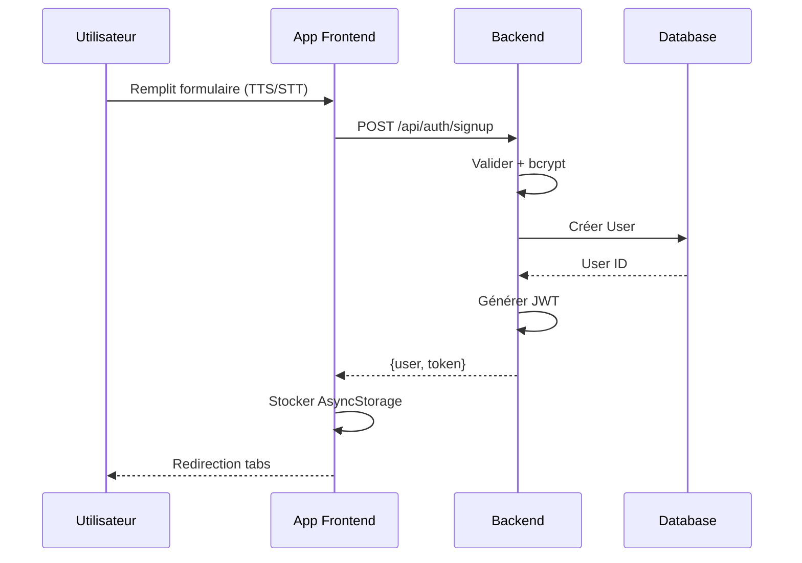
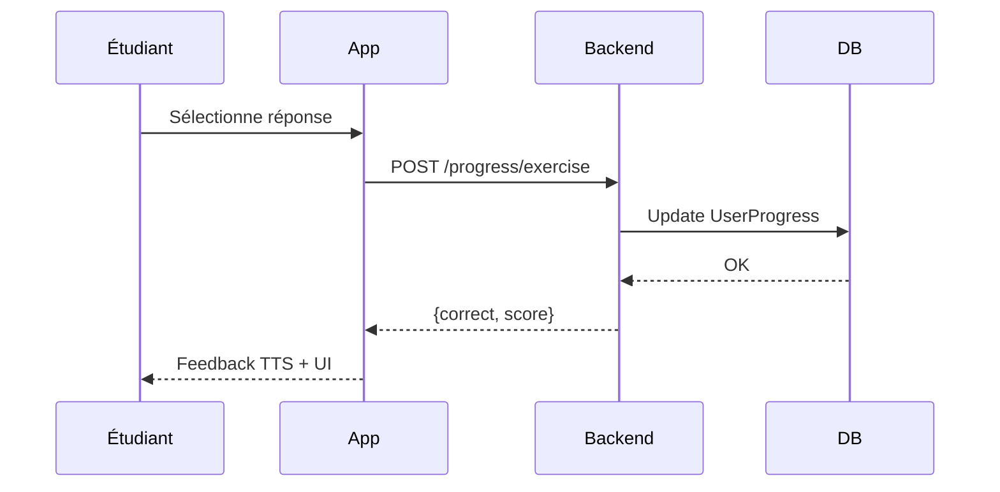
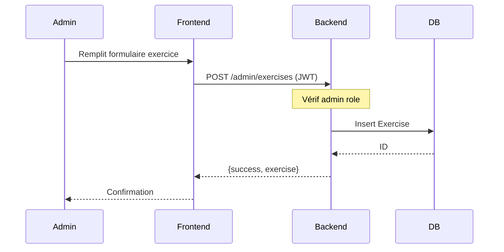
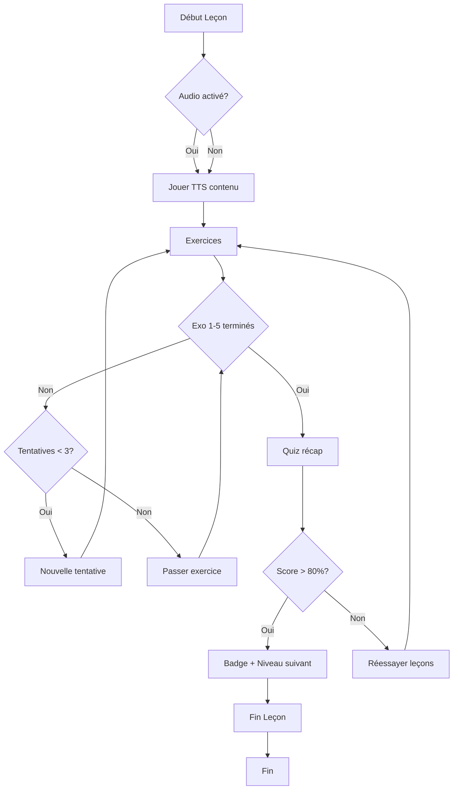
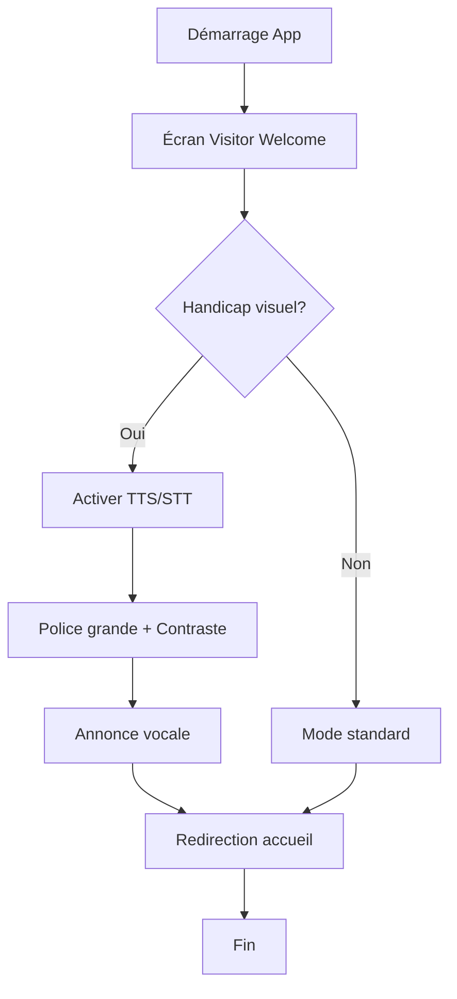

# 📋 CAS D'UTILISATION - BISApp

Documentation des cas d'utilisation principaux de l'application BISApp (Tutorat Braille accessible).

## 1. Liste des Cas d'Utilisation

| ID   | Nom                              | Acteurs        | Priorité |
| ---- | -------------------------------- | -------------- | -------- |
| UC1  | Activer le mode accessibilité    | Visiteur       | Haute    |
| UC2  | Inscription étudiant             | Visiteur       | Haute    |
| UC3  | Connexion étudiant               | Étudiant       | Haute    |
| UC4  | Parcourir le contenu pédagogique | Étudiant       | Haute    |
| UC5  | Compléter un exercice            | Étudiant       | Haute    |
| UC6  | Passer un quiz                   | Étudiant       | Haute    |
| UC7  | Consulter progression et badges  | Étudiant       | Moyenne  |
| UC8  | Connexion administrateur         | Administrateur | Moyenne  |
| UC9  | Créer un exercice (admin)        | Administrateur | Basse    |
| UC10 | S'abonner Premium                | Étudiant       | Basse    |

## 2. Descriptions Détaillées

### UC1: Activer le mode accessibilité

**Acteurs**: Visiteur  
**Préconditions**: L'app est lancée (écran splash terminé)  
**Postconditions**: Paramètres d'accessibilité activés et stockés

**Flux principal**:

1. Système affiche "Êtes-vous déficient visuel ?"
2. Utilisateur sélectionne "Oui/Non/Partiel"
3. Système active TTS, STT, contraste élevé, police grande
4. Système annonce vocalement "Accessibilité activée"
5. Redirection vers accueil visiteur

**Flux alternatifs**:
2a. Utilisateur sélectionne "Non" → Mode standard

**Exceptions**:
3a. Erreur TTS → Fallback mode visuel

### UC2: Inscription étudiant

**Acteurs**: Visiteur  
**Préconditions**: Mode accessibilité configuré  
**Postconditions**: Compte créé, token JWT généré

**Flux principal**:

1. Affichage formulaire 5 étapes (prénom, email, mot de passe, niveau accessibilité, confirmation)
2. Pour chaque champ texte: TTS lit étiquette + prononce lettres saisies
3. Bouton micro (STT) disponible sauf mot de passe
4. Validation serveur → Hash bcrypt → Envoi email confirmation
5. Génération JWT → Stockage AsyncStorage → Redirection tabs

**Flux alternatifs**:
3a. Utilisation STT → Texte reconnu + prononciation

**Exceptions**:
4a. Email existant → Message erreur vocal

### UC3: Connexion étudiant

**Acteurs**: Étudiant  
**Préconditions**: Compte existant  
**Postconditions**: Session active

**Flux principal**:

1. Saisie email (TTS/STT)
2. Saisie mot de passe (TTS étiquette seulement, pas prononciation)
3. Validation serveur → JWT → Redirection tabs

### UC4: Parcourir le contenu pédagogique

**Acteurs**: Étudiant  
**Préconditions**: Connecté  
**Postconditions**: Contenu chargé

**Flux principal**:

1. Sélection module (Braille/Informatique)
2. Sélection niveau (Basique/Moyen/Avancé)
3. Liste chapitres (TTS titres)
4. Sélection chapitre → Liste leçons
5. Lecture leçon (TTS contenu)

### UC5: Compléter un exercice

**Acteurs**: Étudiant  
**Préconditions**: Leçon sélectionnée  
**Postconditions**: Progression sauvegardée

**Flux principal**:

1. Affichage question + 4 options Braille
2. Sélection réponse (tap ou vocal)
3. Feedback immédiat (vert/rouge + TTS "Correct/Incorrect")
4. Max 3 essais
5. Sauvegarde progression serveur
6. Passer exercice suivant

**Flux alternatifs**:
2a. Commande vocale "option 2"

### UC6: Passer un quiz

**Acteurs**: Étudiant  
**Préconditions**: Tous exercices niveau terminés  
**Postconditions**: Score sauvegardé, badge potentiel

**Flux principal**:

1. 10 questions récapitulatives
2. Réponses multiples (3 essais max)
3. Score calculé (>80% → déblocage niveau suivant)
4. Attribution badge automatique

### UC7: Consulter progression et badges

**Acteurs**: Étudiant  
**Préconditions**: Connecté  
**Postconditions**: -

**Flux principal**:

1. Onglet "Succès" → Graphique progression
2. Liste badges obtenus (TTS descriptions)
3. Statistiques (leçons complétées, score moyen)

### UC8: Connexion administrateur

**Acteurs**: Administrateur  
**Préconditions**: Clé admin secrète  
**Postconditions**: Accès dashboard admin

**Flux principal**:

1. Email admin + mot de passe + clé secrète
2. Validation → Redirection dashboard admin

### UC9: Créer un exercice (admin)

**Acteurs**: Administrateur  
**Préconditions**: Connecté admin  
**Postconditions**: Exercice créé en BD

**Flux principal**:

1. Sélection leçon
2. Saisie question, 4 options, réponse correcte
3. Validation → Sauvegarde MongoDB
4. Confirmation

### UC10: S'abonner Premium

**Acteurs**: Étudiant  
**Préconditions**: Connecté  
**Postconditions**: Abonnement actif

**Flux principal**:

1. Sélection Premium → Transcription texte-Braille
2. Paiement SMS (numéro téléphone)
3. Activation abonnement

## 3. Diagrammes de Séquence (Mermaid)

### UC2: Inscription Étudiant

### UC5: Compléter Exercice

### UC9: Créer Exercice (Admin)

## 4. Diagrammes d'Activité (Mermaid)

### Activité: Compléter une Leçon

### Activité: Configuration Accessibilité

## 5. Glossaire

- **TTS**: Text-to-Speech (Synthèse vocale)
- **STT**: Speech-to-Text (Reconnaissance vocale)
- **JWT**: JSON Web Token (Authentification)

---

**Version**: 1.0.0  
**Date**: 2024  
**Langue**: Français
